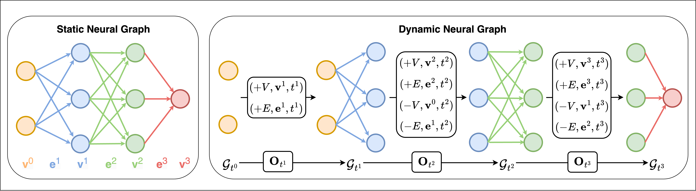

# Dynamic Neural Graph



This repository contains the official implementation for **"Dynamic Neural Graph Encoding of Inference Processes in Deep Weight Space"**.

Dynamic Neural Graph (DNG) represents neural network parameters as graph-structured data and models inference-time information flow in deep weight space. The code includes experiments for INR classification and editing, CNN generalization prediction, CNN Wild Park generalization prediction, and ViT generalization prediction.

## Setup

Before running the code, ensure that your current working directory is the root directory of the repository. Use the following commands to set up the virtual environment:

```bash
conda env create -f environment.yml
conda activate dng
```

## Project Structure

- `experiments/inr_classification/`: INR2JLS training and INR classification experiments.
- `experiments/inr_editing/`: INR editing experiments.
- `experiments/generalization/`: CNN, CNN Wild Park, and ViT generalization prediction experiments.
- `data/`: datasets, graph utilities, Park dataset loading, graph data generation, and downloaded/generated data files.
- `dng_models.py`: core model definitions shared across experiments.

## Generate Dynamic Neural Graph Data

First, generate the Dynamic Neural Graph data for INRs by following these steps:

1. **Download Pre-trained SIREN Weights:**

   - Download SIREN weights trained on the MNIST, FashionMNIST, and CIFAR-10 datasets using [this link](https://drive.google.com/drive/folders/15CdOTPWHqDcS4SwbIdm100rXkTYZPcC5?usp=sharing).
   - Download SIREN weights trained on the CIFAR-100 dataset using [this link](https://drive.google.com/drive/folders/1TwUZmcE2XrGQXCPhGAIa_sXCd5kX8OIA?usp=sharing).

2. Ensure that the downloaded weights are unzipped in the repository-root `./data` directory.

3. Run the following command to generate the Dynamic Neural Graph data:

   ```bash
   python data/generate_graph_data.py --ds [dataset]
   ```

   Where `dataset` can be one of the following options:
   - `mnist` (for MNIST INR dataset)
   - `fashion` (for FashionMNIST INR dataset)
   - `cifar` (for CIFAR-10 INR dataset)
   - `cifar100` (for CIFAR-100 INR dataset)

## INR2JLS and INR Classification

To classify INRs using the INR2JLS framework, we first convert the INRs into latent feature maps through the INR2JLS framework, and then perform classification based on these latent feature maps.

Before running the INR classification experiments, enter the experiment directory:

```bash
# from the repository root
cd experiments/inr_classification
```

### Train the INR2JLS Framework

Run the following command to train the INR2JLS framework and save the DNG-Encoders used to generate latent feature maps:

```bash
python train_inr2jls.py --aug --ds [dataset] --l-size [latent size]
```

Where:
- `dataset` can be one of `mnist`, `fashion`, `cifar`, or `cifar100`.
- `latent size` represents the size of the latent feature maps (H * W). In our experiments:
  - For MNIST INR dataset and FashionMNIST INR dataset, set it to `49`.
  - For CIFAR-10 INR dataset and CIFAR-100 INR dataset, set it to `64`.

### Generate Latent Feature Maps and Classify INRs

Once you have the pre-trained DNG-Encoder, use it to generate latent feature maps and classify the INRs:

```bash
python classify_latent.py --aug --ds [dataset] --l-size [latent size] --enc-dir [encoder directory]
```

Where:
- `dataset` and `latent size` should match the previous choices.
- `encoder directory` is the folder containing the pre-trained DNG-Encoder, e.g., `dng_encoder_models_jls/mnist/2024_01_01_12_00_00`.

### INR Classification using DNG-Encoder Only

Alternatively, you can directly classify the INRs using the DNG-Encoder without generating latent feature maps:

```bash
python classify_encoder.py --aug --ds [dataset]
```

## Editing INRs

Before running the INR editing experiment, enter the experiment directory:

```bash
# from the repository root
cd experiments/inr_editing
```

You can stylize the INRs using the following command:

```bash
python stylize_siren.py --aug --ds [dataset] --style [style]
```

Where:
- `dataset` can be `mnist` or `fashion`.
- `style` can be one of the following options: `dilate`, `erode`, `gradient`.

## Predicting Generalization

Before running the generalization prediction experiments, enter the experiment directory:

```bash
# from the repository root
cd experiments/generalization
```

### CNN Zoo (Small CNN Classifiers)

To predict the generalization of CNN classifiers, you should first ensure that the [CIFAR10](https://storage.cloud.google.com/gresearch/smallcnnzoo-dataset/cifar10.tar.xz) and [SVHN](https://storage.cloud.google.com/gresearch/smallcnnzoo-dataset/svhn_cropped.tar.xz) datasets are placed under the repository-root directory `./data/predict_gen`. After this, you can predict the generalization of CNN classifiers using the following command:

```bash
python predict_cnn.py --ds [dataset] --sigmoid
```

Where:
- `dataset` can be `cifar10` or `svhn`.

### CNN Wild Park (Heterogeneous CNNs)

Predict generalization for heterogeneous CNN architectures with varying layers, channels, kernel sizes, activations, and residual connections.

**Data:** Download `cnn_wild_park.zip` from the [CNN Wild Park dataset](https://zenodo.org/records/12797219) (provided by Kofinas et al.) and place its contents under the repository-root directory `./data/cnn_park_data/`.

```bash
python predict_park.py
```


### ViT Generalization Prediction

Predict generalization for Vision Transformer (ViT) models trained on CIFAR-10.

#### Step 1: Generate ViT Models (optional, if not already provided)

```bash
python ../../data/generate_vit.py --num-models 1000
```

This trains many small ViTs with varying hyperparameters and saves their weights and test accuracies under `./data/cifar10_vit/`.

#### Step 2: Generate DNG Graph Data for ViTs

```bash
python ../../data/generate_graph_data.py --type vit
```

This converts ViT checkpoints into DNG graph format and saves them under `./data/cifar10_vit/graph_data/`.

#### Step 3: Run DNG ViT Experiment

```bash
python predict_vit.py
```
